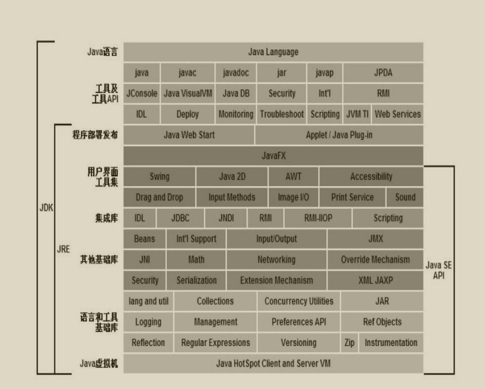

Stream流是jdk8以后的特性，通过stream流，实现对Collection集合的便利操作。
本文研究创建Stream和使用Stream，但注意并不是全面的，只是大致流程。
<!-- more -->
整体分为创建Stream和使用Stream（重点）
# 创建Stream

通过idea分析图，可知Stream有多个接口，含有Stream、IntStream、LongStream、DoubleStream，XXStream是Stream的XX原始特化，
它们提供描述方法和限制，和默认实现。可以使用stream()，生成流（实际是XPipeline管道），实际流程如下：

````Java
// 使用Stream.of(..)直接创建时候，调用
public static<T> Stream<T> of(T... values) {
        return Arrays.stream(values);
    }
public static<T> Stream<T> of(T t) {
        return StreamSupport.stream(new Streams.StreamBuilderImpl<>(t), false);
    }

//比如使用Collection.stream()时候，调用
default Stream<E> stream() {
        return StreamSupport.stream(spliterator(), false);
    }

// 使用Arrays.stream(array)时候，调用
public static <T> Stream<T> stream(T[] array) {
        return stream(array, 0, array.length);
    }
public static <T> Stream<T> stream(T[] array, int startInclusive, int endExclusive) {
        return StreamSupport.stream(spliterator(array, startInclusive, endExclusive), false);
    }
// 注意使用double, Int。只是把数组拆分开，然后仍然调用Arrays.stream(array)
public static IntStream of(int... values) {
        return Arrays.stream(values);
    }
    
// 其他类似
````
可以看到都是最终调用StreamSupport的静态方法stream， stream的两个参数spliterator和parallel是什么呢？
> StreamSupport 提供创建和操作流的低级实用方法。

Spliterator 是用来遍历和划分源元素的对象，可以单独遍历元素和按顺序批量遍历，类似Iterator，再往下就不研究了，属于别的内容了，总之Stream就是用它来进行一系列操作。

parallel 是用来选择是顺序流(false)还是并行流(true)。

当然，StreamSupport也提供了其他的创建流方式，这里说：
````Java
public static <T> Stream<T> stream(Supplier<? extends Spliterator<T>> supplier,
                                       int characteristics,
                                       boolean parallel) {
        Objects.requireNonNull(supplier);
        return new ReferencePipeline.Head<>(supplier,
                                            StreamOpFlag.fromCharacteristics(characteristics),
                                            parallel);
    }
````
supplier是函数接口，用来提供Spliterator。
characteristics是与流和操作的特征相对应的标志。流框架使用标志来控制、专门化或优化计算，可用于描述与流关联的几个不同实体的特征：流源、中间操作和终端操作。
parallel 和上述的一样作用

继续深入，可以发现不同的Stream对应不同的Pipeline，Pipeline调用父类构造函数，构造Pipeline
````Java
AbstractPipeline(Supplier<? extends Spliterator<?>> source,
                     int sourceFlags, boolean parallel) {
        this.previousStage = null;
        this.sourceSupplier = source;
        this.sourceStage = this;
        this.sourceOrOpFlags = sourceFlags & StreamOpFlag.STREAM_MASK;
        // The following is an optimization of:
        // StreamOpFlag.combineOpFlags(sourceOrOpFlags, StreamOpFlag.INITIAL_OPS_VALUE);
        this.combinedFlags = (~(sourceOrOpFlags << 1)) & StreamOpFlag.INITIAL_OPS_VALUE;
        this.depth = 0;
        this.parallel = parallel;
    }
````
在这里设置了头部节点，源Spliterator，源节点，流合并，流合并用的，头深度，并行流。
可以发现AbstractPipeline才是我们流的关键，所有Pipeline调用AbstractPipeline构造，同时所有Stream使用StreamSupport来调用Pipeline创建管道。
这里官方文档(机翻)：
> “管道”类的抽象基类，它们是 Stream 接口及其原始特化的核心实现。管理流管道的建设和评估。
> AbstractPipeline表示流管道的初始部分，封装流源和零个或多个中间操作。各个AbstractPipeline对象通常称为阶段，其中每个阶段描述流源或中间操作。
> 具体的中间阶段通常是从AbstractPipeline构建的，一个扩展它的形状特定的管道类（例如， IntPipeline ）也是抽象的，以及一个扩展它的特定于操作的具体类。 AbstractPipeline包含评估管道的大部分机制，并实现操作将使用的方法；特定于形状的类添加了辅助方法，用于将结果集合处理到适当的特定于形状的容器中。
> 在链接新的中间操作或执行终端操作后，流被认为已被消耗，并且不允许对该流实例进行更多的中间或终端操作。
> 实际说明：
> 对于顺序流和没有有状态中间操作的并行流，并行流，管道评估是在一次通过中完成的，它将所有操作“堵塞”在一起。对于有状态操作的并行流，执行被分成多个段，其中每个有状态操作标记一个段的结束，每个段被单独评估，并将结果用作下一个段的输入。在所有情况下，直到终端操作开始时才使用源数据。

总结一下,stream每次创建实际对象为X_Pipeline.<Head>类型，我们可以通过研究X_Pipeline.<Head>获取我们想要知道的实际方法，
当然在使用过程时，由于方法返回的是不同的实现Stream方法的类和其他返回类型，所以我们要具体分析。

> 注意，Stream.of和Arrays.stream均使用Arrays.stream，它有多个不同参数，如果明确为基本类型的，就会返回IntStream、LongStream、DoubleStream，
> 如果为其他，则为Stream<T>。虽然实际类型为X_Pipeline.<Head>管道类型，但是类引用的类型是不同的，所能使用的方法是不同的。

## 分析涉及管道的结构
刚才我们顺着整体的创建过程分析，可以发现用方法是流，实际载体是管道，StreamSupport连接这二者。
其中StreamSupport返回的new __Pipeline.Head类型，正是，我们管道结构的头。
分析管道数据属性：
````Java
    // 链表的头节点
    private final AbstractPipeline sourceStage;
    // 前一个节点
    private final AbstractPipeline previousStage;
    // 用于合并
    protected final int sourceOrOpFlags;
    // 下一个节点
    private AbstractPipeline nextStage;
    // 节点深度
    private int depth;
    // 用于合并
    private int combinedFlags;

    // 源Spliterator，用于处理数据
    private Spliterator<?> sourceSpliterator;
    // 和Spliterator类似
    private Supplier<? extends Spliterator<?>> sourceSupplier;
    
    // 判断是否管道被连接或者消费
    private boolean linkedOrConsumed;
    // 是否是有状态的操作
    private boolean sourceAnyStateful;
    // 可以用于多线程关闭的
    private Runnable sourceCloseAction;
    // 并行流
    private boolean parallel;
````
再分析重要内部类:
无状态阶段:
````Java
abstract static class StatelessOp<E_IN, E_OUT>
            extends ReferencePipeline<E_IN, E_OUT> {
        StatelessOp(AbstractPipeline<?, E_IN, ?> upstream,
                    StreamShape inputShape,
                    int opFlags) {
            super(upstream, opFlags);
            assert upstream.getOutputShape() == inputShape;
        }

        @Override
        final boolean opIsStateful() {
            return false;
        }
    }
````
有状态阶段：
````Java
abstract static class StatefulOp<E_IN, E_OUT>
            extends ReferencePipeline<E_IN, E_OUT> {
        StatefulOp(AbstractPipeline<?, E_IN, ?> upstream,
                   StreamShape inputShape,
                   int opFlags) {
            super(upstream, opFlags);
            assert upstream.getOutputShape() == inputShape;
        }

        @Override
        final boolean opIsStateful() {
            return true;
        }

        @Override
        abstract <P_IN> Node<E_OUT> opEvaluateParallel(PipelineHelper<E_OUT> helper,
                                                       Spliterator<P_IN> spliterator,
                                                       IntFunction<E_OUT[]> generator);
    }
````
可以看到它们继承ReferencePipeline(当然其他Pipeline里，继承其他Pipeline)，可以看作一片一片的管道，它们存储操作，最终再进行操作，
它们通过调用父节点，实现链表的连接，形成下面的结构：
Head <==> StatelessOp <==> StatelessOp
> 重点是通过重写StatelessOp的opWrapSink方法，然后在最后操作时候被调用，因为其实现了Consumer的接口，可以被源Spliterator调用

Sink是操作元对象，官方文档如下（机翻）:
> Consumer的扩展，用于通过流管道的各个阶段传递值，并使用其他方法来管理大小信息、控制流等。在第一次调用Sink上的accept()方法之前，必须先调用begin()方法来通知它数据即将到来（可选地通知接收器有多少数据即将到来），并且在发送完所有数据之后，您必须调用end()方法。在调用end()之后，你不应该在没有再次调用begin()下调用accept() 。 Sink还提供了一种机制，通过该机制，sink 可以协同发出信号表示它不想再接收任何数据（ cancellationRequested()方法），源可以在向Sink发送更多数据之前对其进行轮询。
> 接收器可能处于两种状态之一：初始状态和活动状态。它以初始状态开始； begin()方法将其转换为活动状态， end()方法将其转换回初始状态，以便重新使用。数据接受方法（如accept()仅在活动状态下有效。
> API说明：
> 流管道由源、零个或多个中间阶段（例如过滤或映射）和终端阶段（例如归约或 for-each）组成。具体来说，考虑管道：
> int longestStringLengthStartingWith = strings.stream().filter(s -> s.startsWith("A")).mapToInt(String::length).max();
> 在这里，我们有三个阶段，过滤、映射和减少。过滤阶段使用字符串并发出这些字符串的一个子集；映射阶段使用字符串并发出整数；缩减阶段使用这些整数并计算最大值。
> Sink实例用于表示此管道的每个阶段，无论该阶段接受对象、整数、长整数还是双精度数。 Sink 具有accept(Object) 、 accept( int )等的入口点，因此我们不需要为每个原始特化提供专门的接口。 （对于这种杂食性趋势，它可能被称为“厨房水槽”。）管道的入口点是过滤阶段的Sink ，它向“下游”发送一些元素——进入映射阶段的Sink ，而水槽又将整数值向下游发送到Sink以进行缩减阶段。与给定阶段关联的Sink实现应该知道下一阶段的数据类型，并在其下游Sink上调用正确的accept方法。同样，每个阶段都必须实现与其接受的数据类型相对应的正确accept方法。
> Sink.OfInt等专用子类型覆盖accept(Object)以调用accept的适当原语特化，实现Consumer的适当原语特化，并重新抽象accept的适当原语特化。
> Sink.ChainedInt等链接子类型不仅实现了Sink.OfInt ，还维护了一个代表下游Sink downstream字段，并实现了begin() 、 end()和cancellationRequested()方法委托给下游Sink 。大多数中间操作的实现将使用这些链接包装器。例如，上面示例中的映射阶段如下所示：
> IntSink is = new Sink.ChainedReference<U>(sink) {public void accept(U u) {downstream.accept(mapper.applyAsInt(u));}};
> 在这里，我们实现了Sink.ChainedReference<U> ，这意味着我们希望接收U类型的元素作为输入，并将下游接收器传递给构造函数。因为下一阶段需要接收整数，所以我们必须在向下游发出值时调用accept( int )方法。 accept()方法将映射函数从U应用到int并将结果值传递给下游Sink 。

最终Sink在最后被excute执行，完成了Stream流一系列操作

# 使用Stream
Stream是惰性流，中间操作实际是存储lambda函数，终端操作是把这个链表的方法执行。
Stream分为中间操作和终端操作，我们分开来说。
## 中间操作
中间操作在源码层面上，就是创建一个继承ReferencePipeline的StatelessOp
在这里，我们使用样例，来进行更好的理解：
````Java
Stream<String> s = Stream.of("一-1", "二-2", "三-3", "四-4", "五-5");
```` 
> lambda函数可以是本对象的方法，还可以是静态用到参数的，或者自己定的

我们先分析Stream，它规范了很多接口，其中用于使用的中间操作如下:
+ Stream<T> filter(Predicate<? super T> predicate);
传入的lambda函数返回bool值，用来进行筛选，不多解释

+ map 系列相关的：
+ Stream<R> map(Function<? super T, ? extends R> mapper); lambda函数返回值不做要求，结果转化为新流
+ IntStream mapToInt(ToIntFunction<? super T> mapper); lambda函数返回值需要为int类型，结果转化为新流
+ LongStream mapToLong(ToLongFunction<? super T> mapper); lambda函数返回值需要为long类型，结果转化为新流
+ DoubleStream mapToDouble(ToDoubleFunction<? super T> mapper); lambda函数返回值需要为double类型，结果转化为新流
也好理解些，难理解的在后面

+ flatMap 系列：
+ Stream<R> flatMap(Function<? super T, ? extends Stream<? extends R>> mapper); 返回值需要继承Stream，它可以遍历流元素，并形成新的流进行处理
+
````Java
  s.flatMap(r -> Arrays.stream(r.split("-")).map(r2 -> r2 + "空格")).forEach(System.out::println);
````
+ IntStream flatMapToInt(Function<? super T, ? extends IntStream> mapper); 返回值需要继承IntStream，它可以遍历流元素，并形成新的流进行处理
+ LongStream flatMapToLong(Function<? super T, ? extends LongStream> mapper); 返回值需要继承LongStream，它可以遍历流元素，并形成新的流进行处理
+ DoubleStream flatMapToDouble(Function<? super T, ? extends DoubleStream> mapper);  返回值需要继承DoubleStream，它可以遍历流元素，并形成新的流进行处理

+ 
+ Stream<T> distinct(); 用来去重
+ sort() / sort(comparator) 用来比较，并排序
+ Stream<T> limit(long maxSize); 用来缩小范围
+ Stream<T> skip(long n); 用来跳过区间
+ Stream<T> peek(Consumer<? super T> action); 类似forEach，但是只有在最后执行（本身如此）

## 终端操作
+ forEach系列
+ void forEach(Consumer<? super T> action); 对流的每个元素执行一个操作
+ void forEachOrdered(Consumer<? super T> action); 如流可以有顺序，则先进行顺序处理

+ reduce 系列
+ T reduce(T identity, BinaryOperator<T> accumulator); // 累加器
+ Optional<T> reduce(BinaryOperator<T> accumulator);
+ U reduce(U identity,BiFunction, ? super T, U> accumulator, BinaryOperator combiner);

+ collect 系列
+ R collect(Supplier supplier,BiConsumer<R, ? super T> accumulator,BiConsumer<R, R> combiner);
+ R collect(Collector<? super T, A, R> collector); //Collector里有可以转化的方式

+ Optional<T> min(Comparator<? super T> comparator); //最小的那个
+ Optional<T> max(Comparator<? super T> comparator); //最大的那个
+ long count(); //统计数量

+ boolean anyMatch(Predicate<? super T> predicate); //是否存在一个匹配
+ boolean allMatch(Predicate<? super T> predicate); //是否全部匹配
+ boolean noneMatch(Predicate<? super T> predicate); //是否没有匹配

+ Optional<T> findFirst(); //找到第一个，并返回
+ Optional<T> findAny(); //找到就行，并返回

+ toArray() 转化为Array
+ toList() 转化为List

### 总结
本文分析了Stream的创建，结构和使用，当然重点在使用，可以提高操作Collection的效率
