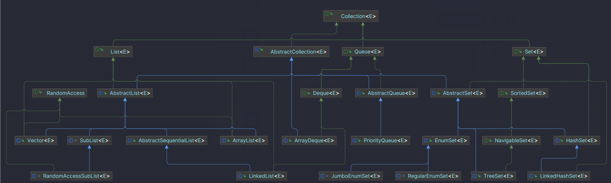

集合类是十分常用的一系列类，主体分为Map为根的实现类和Collection为根的实现类
<!-- more -->

## Collection

咱们先以最常见的Collection说起，先看文档(机翻)
> 集合层次结构中的根接口。
> 集合表示一组对象，称为其元素。
> 某些集合允许重复元素，而其他集合则不允许。有些是有序的，有些是无序的。
> JDK 不提供此接口的任何直接实现：它提供了更具体的子接口（如 Set 和 List）的实现。
> 此接口通常用于传递集合，并在需要最大通用性的地方操作它们。

*由于集合类家族庞大，我们尽量以介绍接口为主，具体实现以重点为介绍。*
根据官方介绍，可以看见Collection接口是用来粗略规定哪些是可以归纳进集合体系的，并且可以用于粗略操作和传递的。

> Collection接口下，整体设计思想为模板方法设计模式，
> 在这种模式中，定义一个操作的算法框架，并将一些步骤延迟到子类中实现。模板方法使得子类可以在不改变算法框架的情况下重新定义算法中的某些步骤。
> 在Java集合类中，接口定义了一些公共方法，而抽象类则提供了一些默认实现，具体的实现类可以根据需要选择性地实现这些方法。
> 例如，AbstractList类提供了一些通用的方法（如get、set、add、remove等），而具体的List实现类（如ArrayList、LinkedList等）只需要实现其中一些方法即可，其余方法则可以继承自AbstractList类。
> 这种模式的优点是可以避免代码重复，提高代码复用性，并且能够方便地扩展和修改代码。
> 看起来有些不知所以然？那就慢慢读下去，看到具体如何做，就一目了然啦~

### Collection接口

基本规定了，增删改查，以及一些其他的方法，具体如下：
**增：**

+ add(E e)
+ 确保此集合包含指定的元素（可选操作）。
+ boolean addAll(Collection<? extends E> c)
+ 将指定集合中的所有元素添加到此集合（可选操作）。

**删：**

+ void clear()
+ 从此集合中删除所有元素（可选操作）。
+ boolean remove(Object o)
+ 从该集合中删除指定元素的单个实例（如果存在）（可选操作）。
+ boolean removeAll(Collection<?> c)
+ 删除指定集合中包含的所有此集合的元素（可选操作）。
+ default boolean removeIf(Predicate<? super E> filter)
+ 删除满足给定谓词的此集合的所有元素。
+ boolean retainAll(Collection<?> c)
+ 仅保留此集合中包含在指定集合中的元素（可选操作）。

**改（没有改元素，只有改成）：**
分为改成Array(数组),Stream(流),Spliterator(迭代器)

+ Object[] toArray()
+ 返回一个包含此集合中所有元素的数组。
+ T[]    toArray(T[] a)
+ 返回包含此集合中所有元素的数组;返回的数组的运行时类型是指定数组的运行时类型。
+ default Stream<E>    stream()
+ 返回以此集合作为源的顺序 Stream。
+ default Stream<E>    parallelStream()
+ 返回可能并行的 Stream与此集合作为其来源。
+ Iterator<E>    iterator()
+ 返回此集合中的元素的迭代器。
+ default Spliterator<E>    spliterator()
+ 创建一个Spliterator在这个集合中的元素。

**查：**
可以查的东西可太多了，例如查一查是否包含某个值或某些值，是否为空，长度为多少，还有重写了Object的equals和hashCode方法，可以用来比较两个集合是否相等

+ boolean contains(Object o)
+ 如果此集合包含指定的元素，则返回 true 。
+ boolean containsAll(Collection<?> c)
+ 如果此集合包含指定 集合中的所有元素，则返回true。
+ boolean equals(Object o)
+ 将指定的对象与此集合进行比较以获得相等性。
+ int hashCode()
+ 返回此集合的哈希码值。
+ boolean isEmpty()
+ 如果此集合不包含元素，则返回 true 。
+ int size()
+ 返回此集合中的元素数。

**注意，这里并没有提供可以查到具体某个元素的方法，只是粗略查询，但有具体精准的删除方法**

每个集合类都需要实现上面这些方法，每个集合类都有上面这些方法，方法虽然繁杂，但为后续使用提供便利。
但jdk并没有直接实现Collection接口，而是提供了更具体的实现接口，Set，List和Queue，同时还提供了AbstractCollection，用来给程序员进行快速实现。

### 分析集合类构成

jdk的集合类庞大，看一下图：

先别急着头大😫，我们庖丁解牛，一步一步来。 根据图，可以看到主要分为三大接口List,Set,Queue。

````Java
//为了快速获取这个接口独特在哪里，写个函数查询不同方法很重要:
class Solution {
    /**
     * 本方法用于不同类的方法继承比较，来更好学习某类
     * @param son 待测类
     * @param father 父类
     * @param mapper 通过比较什么，而判断是否重复
     * @param sout 输出什么
     */
    @SafeVarargs
    public final void soutDistinct(Class<?> son, Class<?> father,
                                   Function<? super Method, ? extends Object> mapper,
                                   Function<? super Method, ? extends Object>... sout) {
        if (!father.isAssignableFrom(son)) {
            throw new IllegalArgumentException("待比较类无继承关系");
        }

        Method[] fatherMethods = father.getMethods();
        if (fatherMethods.length == 0) {
            throw new IllegalArgumentException("父类无方法");
        }

        if (!Arrays.stream(sout).findAny().isPresent()) {
            throw new IllegalArgumentException("输出类型不全");
        }

        List<Object> collect = Arrays.stream(fatherMethods).map(mapper).collect(Collectors.toList());
        Arrays.stream(son.getMethods())
                .distinct()
                .filter(i -> !collect.contains(mapper.apply(i)))
                .forEach(i -> {
                    Arrays.stream(sout).forEach(j -> System.out.print(j.apply(i) + " "));
                    System.out.println();
                });
    }
}
````

通过上面这个方法，可以粗略得知：
List定位为有序集合（序列），可以通过索引访问，可以有重复元素，提供的方法也是以可索引访问而展开的方法。
Set定位为无重复集合，并没有扩展新的方法，而是改了约定。
Queue定位为队列，提供了队列操作的基本方法。

**细心的朋友是否还记得还有个靠前的抽象类AbstractCollection，通过上面的方法，可以知道它扩展了作为类的基本操作。**
**注意这便是模板方法设计模式，后续List、Set、Queue也是类似使用方法**
> q: 那如何通过AbstractCollection来实现自己想要的集合类呢？
> a: 为了实现一个不可修改的集合，程序员只需要扩展这个类并提供iterator和size方法的实现。 （
> iterator方法返回的迭代器必须实现hasNext和next ）
> 要实现可修改的集合，程序员必须另外覆盖此类的add方法（否则将抛出UnsupportedOperationException
> ），并且由iterator方法返回的迭代器必须另外实现其remove方法。

后续的AbstractXX类都是类似作用，通过可选择性实现某些方法，来实现自己想要的集合类

在大致分析完Collection接口的直接继承接口后，我们开始具体分析吧~

### 分析List

List接口继承Collection接口，提供了一些新的方法，如下:
大致在改和查上有所体现

+ get
+ 根据索引获取值
+ indexOf
+ 查看该元素首个位置
+ lastIndexOf
+ 查看该元素最后的位置
  可以通过索引找到元素，也可以通过元素找到索引

+ replaceAll
+ 替换掉所有符合类型的元素
+ set
+ 设置某元素
  替换某些元素

+ subList
+ 返回指定范围的视图
+ listIterator
+ 返回列表迭代器（之前Collection也有规定其他样式的迭代器嗷）
+ sort
+ 排序
  改成或返回新的形式

通过观察类图可知，其主要实现的主要类为AbstractList，其他类继承该类。
> q: AbstractList是什么呢？
> a: AbstractList是Java集合框架中的一个抽象类，实现了List接口并提供了一些通用的方法实现。它的主要作用是为具体的List实现类提供一个通用的模板，使得开发者可以更方便地实现自己的List类。
> 但注意由于AbstractList没有自己的数据，所以相关数据的操作，它是抛出异常的，当然这样算是实现了方法，某种意义上，和AbstractCollection一样可以关闭了某些方法使用
> q：那如何通过AbstractList来实现自己的List类呢？
> a: 要实现一个不可修改的列表，程序员只需要扩展这个类并提供get(int)和size()方法的实现。
> 要实现可修改的列表，程序员必须另外覆盖set(int, E)方法（否则会抛出一个UnsupportedOperationException ）。
> 如果列表是可变大小，则程序员必须另外覆盖add(int, E)和remove(int)方法。

观察AbstractList，它有个关键字段modCount。
作用是记录被结构修改的次数，就是每一次操作记录一下，配合迭代器使用，可以在迭代器进行完后，检查是否和迭代器计数比对，来判断是否操作正常（考虑到了并发）。
*形象的说，就是古代账房中的每次记录，最终需要考核来判断是不是中间算账的时候出现问题。*

注意AbstractList的关键是如何拓展，因为后续类也是职责也是由此而生的：
实现不可修改的列表：提供get(int),size()
实现可修改的列表：提供get(int),size(),set(int, E)
实现可变大小：提供get(int),size(),add(int, E, remove(int)

#### 非AbstractList一族

那不继承AbstractList的有哪些类？发现有SubList，RandomAccessSubList
> 先看看机器人怎么说？
> SubList是Java集合框架中的一个类，它是List接口的一个实现类，用于表示原List中的一个子列表。SubList可以看作是原List的一个视图，它提供了一种方便的方式来访问原List中的一部分元素。
>
SubList的作用在于，它允许开发者对原List中的一个子列表进行操作，包括添加、删除、修改和遍历等。这种操作会直接影响原List中相应的元素，因为SubList只是原List的一个视图，它与原List共享相同的数据存储结构，对SubList的操作会直接反映在原List中。
> 使用SubList的好处在于，它提供了一种方便的方式来对List中的一部分元素进行操作，避免了使用循环或索引访问等繁琐的操作。另外，SubList还可以用于将一个List分割成多个部分进行处理，使得代码更加可读、可维护。
> 需要注意的是，对SubList的操作可能会影响原List的结构，因此在使用SubList时需要格外小心，确保操作的正确性。此外，SubList并不是线程安全的，因此在多线程环境下使用时需要进行同步处理。

这下明白了，为什么直接new不了，它是用于对子列表的操作的列表，能new出来就有怪了。
由于不是特别常用，就先不继续往下分析SubList了。

#### AbstractList一族

观察类图可以得知，终于到了能用的实现类了，有Vector，ArrayList和AbstractSequentialList(后续LinkList)
Vector和ArrayList是基于数组实现的，咱们先说Vector:

##### Vector

Vector是Java集合框架中的一个类，它实现了List接口以及一些其他的接口，如Cloneable、Serializable等接口，
可以看作是一种可自动扩容的数组。Vector类的功能和ArrayList类类似，不同之处在于，Vector是线程安全的，支持多线程并发访问，但是在多线程环境下性能较低。
Vector提供了以下方法：
还是增删改查，同时都是相关Element

##### 增加元素

- addElement(E obj)：在Vector的末尾添加一个元素。
- insertElementAt(E obj, int index)：在Vector的指定位置插入一个元素。

##### 删除元素

- removeElement(Object obj)：移除Vector中的指定元素。
- removeElementAt(int index)：移除Vector中指定位置的元素。

##### 修改元素

- setElementAt(E obj, int index)：将Vector中指定位置的元素替换为指定元素。

##### 查找元素

- elementAt(int index)：返回Vector中指定位置的元素。
- firstElement()：返回Vector中的第一个元素。
- lastElement()：返回Vector中的最后一个元素。

##### 其他操作

- capacity()：返回Vector的容量大小。
- ensureCapacity(int minCapacity)：设置Vector的容量大小，如果当前容量小于指定容量，则自动增加容量。
- trimToSize()：将Vector的容量设置为当前元素数量，释放多余的空间。

##### ArrayList

通过之前的函数可以发现，ArrayList并没有提供关于增删改查的方法，只是提供了一些其他操作。
虽然它提供的方法基本和AbstractList的方法类似，但进行了具体实现（篇幅有限，先不说它），使其线程不安全，但操作较为快速。

##### 其他操作

+ clone()：赋值ArrayList。
+ trimToSize()：将ArrayList的容量设置为当前元素数量，释放多余的空间。
+ ensureCapacity(int minCapacity)：设置ArrayList的容量大小，如果当前容量小于指定容量，则自动增加容量。

当然在ArrayList不止有本身类方法的重写，也写了许多内部类：SubList(服务于subList)、Ltr与ListLtr(服务于获取迭代器)。

##### AbstractSequentialList

> q: AbstractSequentialList是什么？
> a: 先来看看官方介绍：
> 此类提供的骨干实现List界面最小化以实现此接口由“连续访问”数据存储备份所需的工作（如链接列表）。
> 对于随机访问数据（如数组），AbstractList应优先于此类。
>
> q: 那如何通过AbstractSequentialList实现连续访问的List类呢？
> a: 为了实现一个列表，程序员只需要扩展这个类，并提供listIterator和size方法的实现。
> 对于一个不可修改的列表，程序员只需要实现列表迭代器的hasNext，next，hasPrevious，previous和index方法。
> 对于可修改的列表，程序员应该另外实现list iterator的set方法。
> 对于可变大小的列表，程序员应该另外实现list iterator的remove和add方法。

观察源码可以看到，AbstractSequentialList将它的方法(增add删remove改set查get)实现，并使用listIterator来实现。
所以我们重点是实现listIterator，相当于我们需要实现一个迭代器，并根据需求把迭代器的方法灵活调整，来灵活实现所需List

### 分析Queue

终于分析完了List

Queue接口也是继承自Collection接口的，它表示一种队列的数据结构，支持在队列的末尾添加元素，在队列的头部移除元素，并支持查询队列的头部元素。
Queue接口提供了以下方法：

+ offer
+ 在队列的末尾添加元素，如果队列已满则返回false
+ poll
+ 移除队列的头部元素，如果队列为空则返回null
+ element
+ 返回队列的头部元素，如果队列为空则抛出异常
+ peek
+ 返回队列的头部元素，如果队列为空则返回null
+ 另外，Queue接口还继承了Collection接口中的一些方法，例如size、isEmpty、contains、iterator等方法，这些方法的含义与Collection接口中的含义相同。

类似List，Queue也是主要依靠AbstractQueue来作为模板，来编写实现类的。

#### AbstractQueue

观察源码可以看到，它把之前AbstractCollection所需的方法进行了拓展和修改，
> 此类提供某些Queue操作的框架实现。当基实现不允许空元素时，此类中的实现是合适的。
> 方法 add、 和 分别基于 offer、 poll remove和 element peek，但会引发异常，而不是通过 false 或 null 返回来指示失败。

同样的模板方法设计模式，我们只需要实现offer、poll、peek、size方法即可，之前的Collection所需方法被用offer、poll、peek来实现了。
我们类似之前的写作手法，先看看不使用模板方法的接口Deque

##### 非AbstractQueue一族 Deque接口

Deque是Java集合框架中的双端队列接口，它继承了Queue接口，并提供了一系列在队列两端进行插入、删除、获取元素的方法。
Deque可以被实现为线程安全的或非线程安全的，具体实现类有ArrayDeque和LinkedList等。
以下是Deque接口中定义的常用方法：

##### 增加元素：

- addFirst(E e)：将指定元素插入Deque的开头；
- addLast(E e)：将指定元素插入Deque的结尾；
- offerFirst(E e)：将指定元素插入Deque的开头，如果Deque已满，则返回false；
- offerLast(E e)：将指定元素插入Deque的结尾，如果Deque已满，则返回false；
- push(E e)：将指定元素插入Deque的开头，相当于addFirst方法。

##### 删除元素：

- removeFirst()：移除Deque的开头元素，如果Deque为空，则抛出NoSuchElementException异常；
- removeLast()：移除Deque的结尾元素，如果Deque为空，则抛出NoSuchElementException异常；
- pollFirst()：移除Deque的开头元素，如果Deque为空，则返回null；
- pollLast()：移除Deque的结尾元素，如果Deque为空，则返回null；
- pop()：移除Deque的开头元素，相当于removeFirst方法。

##### 获取元素：

- getFirst()：获取Deque的开头元素，如果Deque为空，则抛出NoSuchElementException异常；
- getLast()：获取Deque的结尾元素，如果Deque为空，则抛出NoSuchElementException异常；
- peekFirst()：获取Deque的开头元素，如果Deque为空，则返回null；
- peekLast()：获取Deque的结尾元素，如果Deque为空，则返回null；
- element()：获取Deque的开头元素，相当于getFirst方法。

##### 其他操作：

- removeFirstOccurrence(Object o)：移除Deque中第一次出现的指定元素；
- removeLastOccurrence(Object o)：移除Deque中最后一次出现的指定元素；
- descendingIterator()：返回一个反向迭代器，可以从Deque的尾部向头部迭代。

需要注意的是，如果Deque是空的，调用getFirst、getLast、element等方法会抛出NoSuchElementException异常。
如果调用addFirst、addLast、offerFirst、offerLast等方法时，Deque已满，则会抛出IllegalStateException异常。

##### ArrayDeque 和 LinkedList

那我们说一下ArrayDeque，它是Deque接口的一个实现类，它是基于数组实现的双端队列，它没有容量上限，可以根据需要自动扩容（具体自动扩容可以详细查看源码）。
LinkedList是Deque接口的另一个实现类，它是基于链表实现的双端队列，它没有容量上限，也可以根据需要自动扩容。

> 比较一下两者

+ 内部实现：ArrayDeque采用循环数组的形式实现，而LinkedList则采用链表的形式实现。循环数组可以更好地利用计算机内存的缓存机制，因此在插入、删除、获取元素等操作中具有更优秀的性能。而链表则可以很方便地进行元素的插入和删除操作，但是在访问元素时需要遍历整个链表，因此访问元素的性能相对较低。
+ 内存占用：相比于ArrayDeque，LinkedList具有较大的内存占用。由于LinkedList采用链表的形式实现，需要为每个元素分配独立的内存空间。而ArrayDeque则采用一个数组存储所有元素，因此可以避免为每个元素分配独立的内存空间带来的开销。
+ 线程安全性：ArrayDeque是非线程安全的，不支持多线程并发访问。而LinkedList则是非线程安全的，但可以通过Collections.synchronizedList方法或者使用ConcurrentLinkedDeque等线程安全的类来实现多线程并发访问。

#### AbstractQueue一族

让我们说回AbstractQueue部分，在类图中可以看到只有PriorityQueue(当然在别的地方也有继承，但在这里先不讨论)
继承了AbstractQueue，那让我们来分析它。
> PriorityQueue是什么呢？
> PriorityQueue是堆结构，它可以用于对元素进行排序并快速地获取优先级最高的元素。PriorityQueue可以存储任何可比较的元素，包括基本数据类型和自定义对象。
> PriorityQueue的实现基于二叉堆数据结构，它是一种完全二叉树，并且具有以下性质：
> 父节点的值小于或等于其子节点的值（小根堆）
> 父节点的值大于或等于其子节点的值（大根堆）
> PriorityQueue默认采用小根堆的形式实现，也可以通过传入一个Comparator对象来修改为大根堆。
> 在PriorityQueue中，插入元素和删除元素的时间复杂度均为O(log n)，其中n为队列中元素的个数。

观察PriorityQueue，可以发现它并没有扩展方法，类似之前的AbstractSequentialList的设计模式（模板方法）一样，并使用比较器贯穿所有方法，以此实现堆。

### 分析Set接口

前文说到Set并没有扩展新方法，而是增加了约定。
> 先来看看官方定义:
> 不包含重复元素的集合。更正式地，集合不包含一对元素e1和e2，使得e1.equals(e2)，并且最多一个空元素。正如其名称所暗示的那样，这个接口模拟了数学集抽象。
> Set接口除了继承自Collection接口的所有构造函数的合同以及add,equals和hashCode方法的合同外，还增加了其他规定。

和前文一样，使用模板方法设计模式的AbstractSet来进行实现Set类，但是这次我们先分析不使用AbstractSet的SortedSet

#### SortedSet接口和NavigableSet接口

SortedSet是Java集合框架中的一种有序集合，它继承自Set接口，保证其中的元素是按照某种特定的排序方式进行排序的。
SortedSet中新增的方法主要是与排序有关的方法，包括：

- first()：返回集合中的第一个元素。
- last()：返回集合中的最后一个元素。
- headSet(E toElement)：返回一个子集合，其中包含小于指定元素的所有元素。
- subSet(E fromElement, E toElement)：返回一个子集合，其中包含大于等于fromElement且小于toElement的所有元素。
- tailSet(E fromElement)：返回一个子集合，其中包含大于等于指定元素的所有元素。

很明显由于该集合有一定顺序，所以提供的方法可以只通过元素来获取一段子集合，而不需要通过索引来获取。

而我们下面要讲述的NavigableSet接口是SortedSet接口的拓展，它提供了一些导航方法，可以更灵活的对集合进行操作。

- lower(E e)：返回集合中小于指定元素的最大元素。
- floor(E e)：返回集合中小于等于指定元素的最大元素。
- ceiling(E e)：返回集合中大于等于指定元素的最小元素。
- higher(E e)：返回集合中大于指定元素的最小元素。
  返回指定一定范围的某个元素。

- pollFirst()：返回集合中的第一个元素，并在集合中删除该元素。
- pollLast()：返回集合中的最后一个元素，并在集合中删除该元素。
  删除元素。

- descendingSet()：返回集合中的逆序集合。
- descendingIterator()：返回集合中的逆序迭代器。
  返回逆序集合或逆序迭代器。

值得注意的是NavigableSet并没有对之前Set接口进行实现，提供了扩展方法接口。

#### AbstractSet
> 说回我们的AbstractSet，此类提供 Set 接口的框架实现，以最大程度地减少实现此接口所需的工作量。
> 通过扩展此类实现集合的过程与通过扩展 AbstractCollection 实现集合的过程相同，只是此类子类中的所有方法和构造函数都必须遵守 Set 接口施加的其他约束

观察源码可以发现，它只是实现了equals,hashCode,removeAll方法，除此并没有进行其他操作了，这样的简便使得后续Set的实现变得简单和多样。
AbstractSet下分三个类，分别是HashSet,TreeSet,EnumSet。我们简单介绍一下： 

##### EnumSet

EnumSet是Java集合框架中的一种特殊的集合，它专门用于存储枚举类型的元素。
由于枚举类型的取值是有限的、固定的，EnumSet可以使用位向量来表示集合元素，从而提高了性能和空间效率。EnumSet提供了多种操作方法，如add()、remove()、contains()等，同时它还实现了Set接口，因此可以直接使用Set中的大部分方法。

EnumSet是用来配合枚举类使用的，可以较为方便的管理枚举类
提供下面的方法，用来生成EnumSet：
+ allOf(类<E> elementType)
+ 创建一个包含指定元素类型中所有元素的枚举集。
+ EnumSet<E>	clone()
+ 返回此集合的副本。
+ EnumSet<E>	complementOf(EnumSet<E> s)
+ 创建与指定枚举集具有相同元素类型的枚举集，最初包含此类型的所有元素，该元素 不包含在指定的集合中。
+ EnumSet<E>	copyOf(Collection<E> c)
+ 创建从指定集合初始化的枚举集。
+ EnumSet<E>	copyOf(EnumSet<E> s)
+ 创建与指定的枚举集相同的元素类型的枚举集，最初包含相同的元素（如果有）。
+ EnumSet<E>	noneOf(类<E> elementType)
+ 使用指定的元素类型创建一个空的枚举集。
+ EnumSet<E>	of(E e)
+ 创建一个最初包含指定元素的枚举集。
+ EnumSet<E>	range(E from, E to)
+ 创建最初包含由两个指定端点定义的范围内的所有元素的枚举集。

##### TreeSet 和 HashSet

由于我们篇幅有限，底层原理先不具体说，所以暂且将两个拿在一起介绍。

TreeSet是Java集合框架中的一种有序集合，它实现了SortedSet接口，可以根据元素的自然排序或者指定的Comparator进行排序。
TreeSet底层是基于红黑树实现的，因此插入、删除、查找等操作的时间复杂度都是O(logN)。TreeSet提供了多种操作方法，如add()、remove()、contains()等，同时它还实现了NavigableSet接口，提供了一些导航方法，如lower()、floor()、ceiling()、higher()等。

HashSet是Java集合框架中的一种无序集合，它底层是基于HashMap实现的，元素被存储在HashMap的key中，而value是一个常量Object对象，因此具有HashMap的优点，如快速插入、删除、查找等操作。
HashSet中的元素是无序的，并且不允许重复元素的存在。HashSet提供了多种操作方法，如add()、remove()、contains()等，同时实现了Set接口，因此可以直接使用Set中的大部分方法。

它们的使用场景不同：
HashSet适用于快速插入、删除、查找元素，并且不需要考虑元素的顺序的场景，如去重、查找等。而TreeSet适用于对元素进行排序和范围查找的场景，如按照年龄、姓名等进行排序和查找。

## Map
MAP部分也是个大内容，时间关系，挖个坑以后填😀
